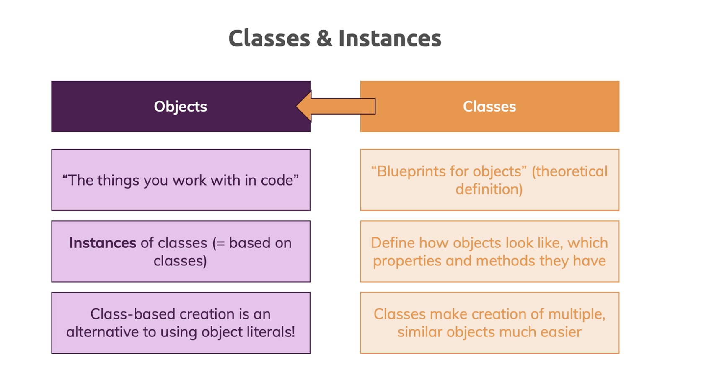

# ts_course

- [ts_course](#ts_course)

  - [Getting Started](#getting-started)
  - [TypeScript Basics & Basic Types](#typescript-basics--basic-types)
  - [The TypeScript Compiler (and its Configuration)](#the-typescript-compiler-and-its-configuration)
  - [Next-generation JavaScript & TypeScript](#next-generation-javascript--typescript)
  - [Classes & Interfaces](#classes--interfaces)
  - [Advanced Types](#advanced-types)
  - [Generics](#generics)
  - [Decorators](#decorators)
  - [Sezione 9:Practice Time! Let's build a Drag & Drop Project](#sezione-9practice-time-lets-build-a-drag--drop-project)
  - [Sezione 10:Modules & Namespaces](#sezione-10modules--namespaces)
  - [Sezione 11:Using Webpack with TypeScript](#sezione-11using-webpack-with-typescript)
  - [Sezione 12:3rd Party Libraries & TypeScript](#sezione-123rd-party-libraries--typescript)
  - [Sezione 13:Time to Practice!](#sezione-13time-to-practice)
  - [Sezione 14:React.js & TypeScript](#sezione-14reactjs--typescript)
  - [Sezione 15:Node.js + Express & TypeScript](#sezione-15nodejs--express--typescript)
  - [Sezione 16:Course Roundup](#sezione-16course-roundup)

## Getting Started


## TypeScript Basics & Basic Types

see `section2` examples folder

https://www.typescriptlang.org/docs/handbook/basic-types.html

## The TypeScript Compiler (and its Configuration)

https://www.typescriptlang.org/tsconfig

see `section3` examples folder

you can run `watch` compile in this way

```
tsc app.ts -w
```

or if you have multiple files, create `tsconfig.json` with

```
tsc --init
```

and then with only `tsc` compile all files, or combined in `watch` mode :

```
tsc --watch
```

or

```
tsc -w
```

These links might also be interesting:

[tsconfig](https://www.typescriptlang.org/docs/handbook/tsconfig-json.html)

[Compiler Config](https://www.typescriptlang.org/docs/handbook/compiler-options.html)

[VS Code TS Debugging](https://code.visualstudio.com/docs/typescript/typescript-debugging)

## Next-generation JavaScript & TypeScript

https://kangax.github.io/compat-table/es6/

> [reference-vs-primitive-values](https://academind.com/learn/javascript/reference-vs-primitive-values/)

see `section4` examples folder

## Classes & Interfaces

see `section5` examples folder



[Public_class_fields](https://developer.mozilla.org/en-US/docs/Web/JavaScript/Reference/Classes/Public_class_fields)
[Inheritance_and_the_prototype_chain](https://developer.mozilla.org/en-US/docs/Web/JavaScript/Inheritance_and_the_prototype_chain)

These links might also be interesting:

[More on (JS) Classes](https://developer.mozilla.org/en-US/docs/Web/JavaScript/Reference/Classes)

[More on TS Interfaces](https://www.typescriptlang.org/docs/handbook/interfaces.html)

## Advanced Types

see `section6` examples folder

<!-- 0 / 12|52 min -->

## Generics

see `section7` examples folder

<!-- 0 / 12|52 min -->

## Decorators

see `section8` examples folder

<!-- 0 / 16|1 h 17 min -->

## Sezione 9:Practice Time! Let's build a Drag & Drop Project

<!-- 0 / 20|2 h 41 min -->

## Sezione 10:Modules & Namespaces

<!-- 0 / 11|50 min -->

## Sezione 11:Using Webpack with TypeScript

<!-- 0 / 9|33 min -->

## Sezione 12:3rd Party Libraries & TypeScript

<!-- 0 / 7|30 min -->

## Sezione 13:Time to Practice!

<!-- 0 / 8|27 min -->

## Sezione 14:React.js & TypeScript

<!-- 0 / 13|45 min -->

## Sezione 15:Node.js + Express & TypeScript

<!-- 0 / 9|43 min -->

## Sezione 16:Course Roundup

<!-- 0 / 1|3 min -->
