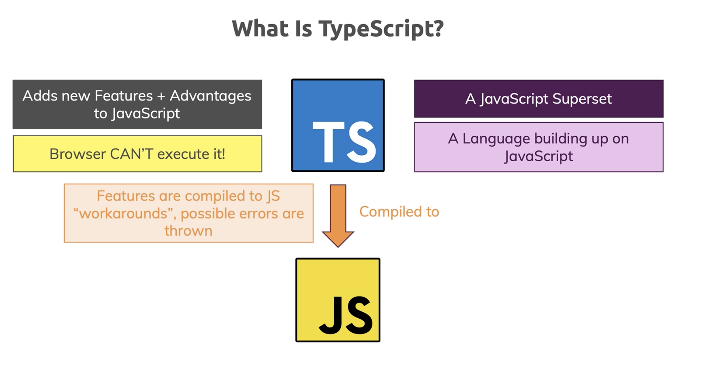
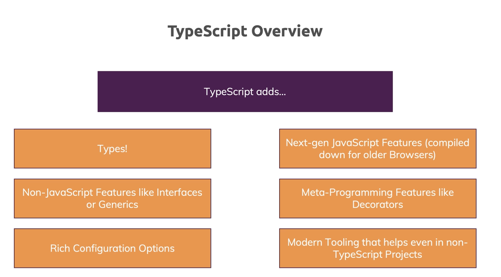
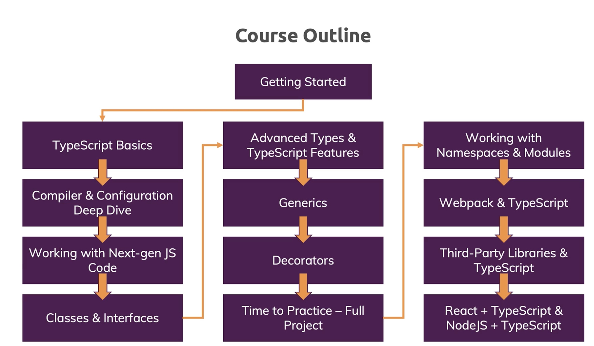
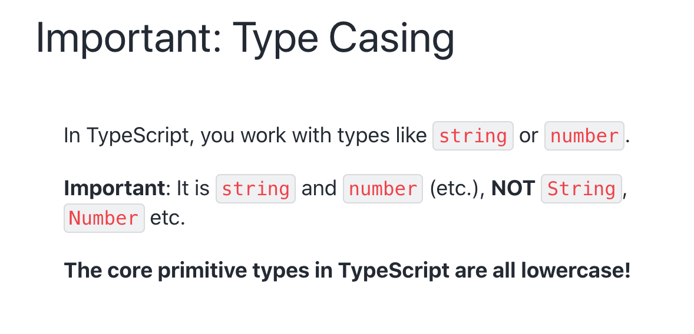
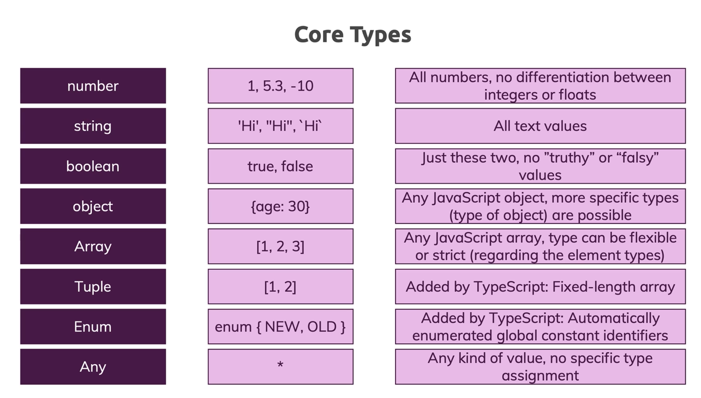
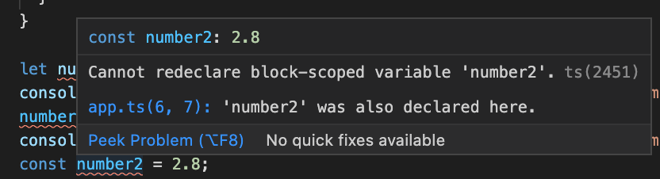
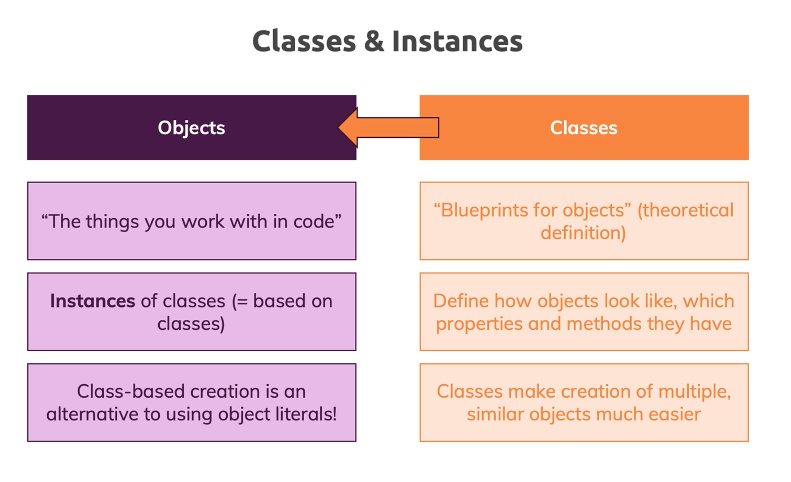
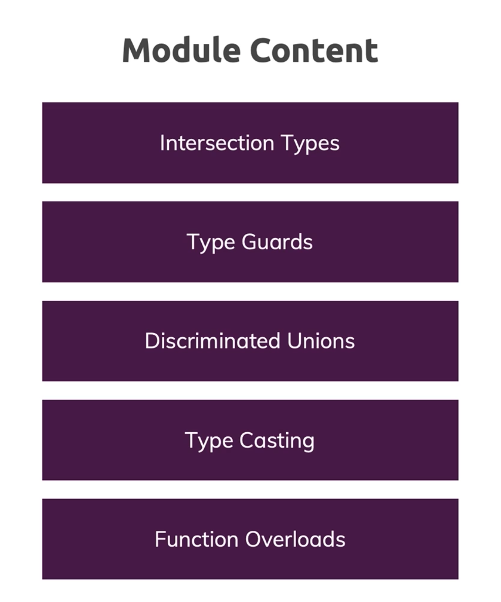
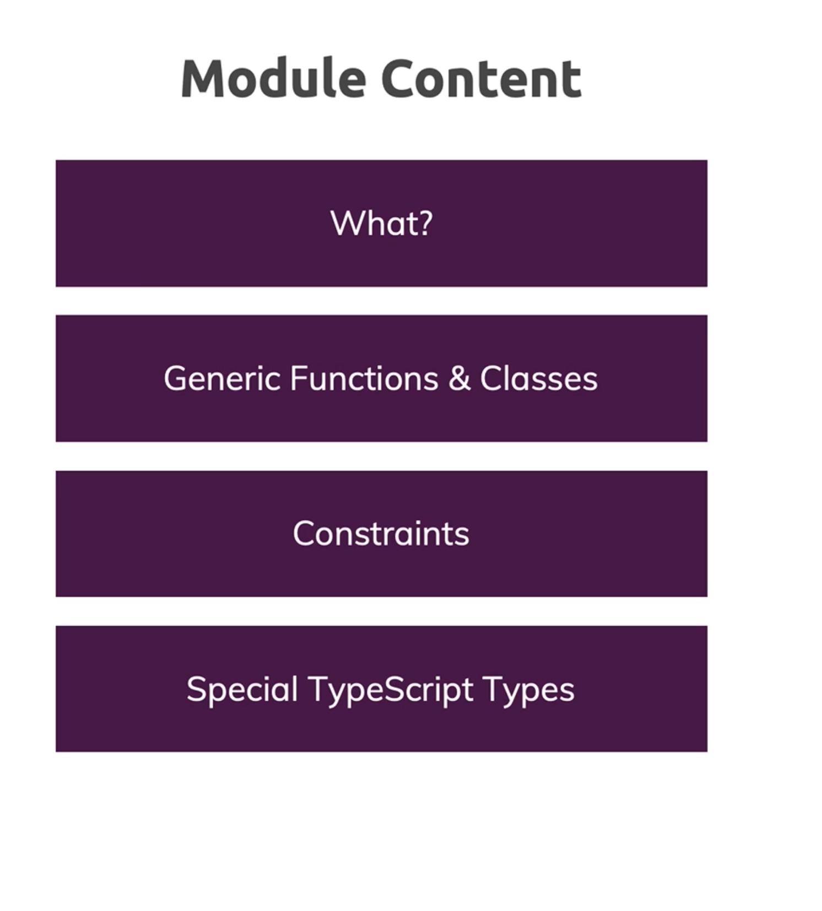

# ts_course

- [ts_course](#ts_course)
  - [Section 1 : Getting Started](#section-1--getting-started)
  - [Section 2 : TypeScript Basics & Basic Types](#section-2--typescript-basics--basic-types)
    - [01-ts-benefits](#01-ts-benefits)
    - [02-js-types](#02-js-types)
    - [03-core-data-types](#03-core-data-types)
    - [04-type-inferrance-and-assignments](#04-type-inferrance-and-assignments)
    - [05-object-types](#05-object-types)
    - [06-arrays](#06-arrays)
    - [07-tuples](#07-tuples)
    - [08-enums](#08-enums)
    - [09-union-types](#09-union-types)
    - [10-literal-types](#10-literal-types)
    - [11-type-aliases](#11-type-aliases)
    - [12-function-types](#12-function-types)
    - [13-unknown-never](#13-unknown-never)
  - [Section 3 : The TypeScript Compiler (and its Configuration)](#section-3--the-typescript-compiler-and-its-configuration)
    - [01-watch-mode-tsconfig](#01-watch-mode-tsconfig)
    - [02-excluding](#02-excluding)
    - [03-config-finished](#03-config-finished)
    - [04-chrome-debugging](#04-chrome-debugging)
  - [Section 4 : Next-generation JavaScript & TypeScript](#section-4--next-generation-javascript--typescript)
    - [02-let-conts-arrow-functions](#02-let-conts-arrow-functions)
    - [03-spread-operator](#03-spread-operator)
    - [04-destructuring](#04-destructuring)
  - [Section 5 : Classes & Interfaces](#section-5--classes--interfaces)
    - [02-class-and-this-basics](#02-class-and-this-basics)
    - [03-private-and-public](#03-private-and-public)
    - [04-shorter-init-syntax](#04-shorter-init-syntax)
    - [05-readonly](#05-readonly)
    - [06-inheritance](#06-inheritance)
    - [07-overriding-and-protected](#07-overriding-and-protected)
    - [08-getters-and-setters](#08-getters-and-setters)
    - [09-abstract](#09-abstract)
    - [10-private-constructors](#10-private-constructors)
    - [11-basic-interfaces](#11-basic-interfaces)
    - [12-implementing-interfaces](#12-implementing-interfaces)
    - [13-interface-inheritance](#13-interface-inheritance)
    - [14-interface-function-types](#14-interface-function-types)
    - [15-optional-properties](#15-optional-properties)
  - [Section 6 : Advanced Types](#section-6--advanced-types)
    - [02-intersection-types](#02-intersection-types)
    - [03-type-guards](#03-type-guards)
    - [04-discriminated-unions](#04-discriminated-unions)
    - [05-type-casting](#05-type-casting)
    - [06-index-properties](#06-index-properties)
    - [08-optional-chaining-nullish-coalescing](#08-optional-chaining-nullish-coalescing)
  - [Section 7 : Generics](#section-7--generics)
    - [02-first-generic-method](#02-first-generic-method)
    - [03-another-generic-function](#03-another-generic-function)
    - [04-keyof-constraints](#04-keyof-constraints)
    - [05-generic-classes](#05-generic-classes)
    - [06-finished](#06-finished)
  - [Section 8 : Decorators](#section-8--decorators)
  - [Section 9 : Practice Time! Let's build a Drag & Drop Project](#section-9--practice-time-lets-build-a-drag--drop-project)
  - [Section 10 : Modules & Namespaces](#section-10--modules--namespaces)
  - [Section 11 : Using Webpack with TypeScript](#section-11--using-webpack-with-typescript)
  - [Section 12 : 3rd Party Libraries & TypeScript](#section-12--3rd-party-libraries--typescript)
  - [Section 13 : Time to Practice!](#section-13--time-to-practice)
  - [Section 14 : React.js & TypeScript](#section-14--reactjs--typescript)
  - [Section 15 : Node.js + Express & TypeScript](#section-15--nodejs--express--typescript)
  - [Section 16 : Course Roundup](#section-16--course-roundup)

## Section 1 : Getting Started





Install `ts`
https://www.typescriptlang.org/download

## Section 2 : TypeScript Basics & Basic Types

see `section2` examples folder

### 01-ts-benefits
```ts
function add(n1: number, n2: number) {
  return n1 + n2;
}

const number1 = 5;
const number2 = 2.8;

const result = add(number1, number2);
console.log(result);
```



### 02-js-types

> for `js` and `ts` all numbers are `floats`
```ts
const number1 = 5; // 5.0
```
### 03-core-data-types


### 04-type-inferrance-and-assignments




### 05-object-types
```ts
// const person: {
//   name: string;
//   age: number;
// } = {
const person = { // also with :object type
  name: 'Maximilian',
  age: 30
};
```
 or 
```ts
const person : {
    name : string;
    age : number;
} = {
    name: 'Maximilian',
    age: 30
};
```

`Nested Objects & Types` : Of course object types can also be created for nested objects.

Let's say you have this JavaScript object:
```ts
const product = {
  id: 'abc1',
  price: 12.99,
  tags: ['great-offer', 'hot-and-new'],
  details: {
    title: 'Red Carpet',
    description: 'A great carpet - almost brand-new!'
  }
}
```
This would be the type of such an object:
```ts
{
  id: string;
  price: number;
  tags: string[],
  details: {
    title: string;
    description: string;
  }
}
```
So you have an object type in an object type so to say.

### 06-arrays
```ts
(property) hobbies: string[]
```
example 
```js
    const person = {
    name: 'Maximilian',
    age: 30,
    hobbies: ['Sports', 'Cooking']
    };

    for (const hobby of person.hobbies) {
        console.log(hobby.toUpperCase());
    }
```

### 07-tuples
```ts
const person: {
  name: string;
  age: number;
  hobbies: string[];
  role: [number, string]; // tuples - fixed-length array : Added by TS
}
```
### 08-enums

```ts
enum Role { ADMIN = 'ADMIN', READ_ONLY = 100, AUTHOR = 'AUTHOR' };
```


see also [any](https://www.typescriptlang.org/docs/handbook/basic-types.html#any) type

### 09-union-types

```ts
function combine(input1: number | string, input2: number | string) {
  let result;
  if (typeof input1 === "number" && typeof input2 === "number") {
    result = input1 + input2;
  } else {
    result = input1.toString() + input2.toString();
  }
  return result;

```

### 10-literal-types
```ts
function combine(
  input1: number | string,
  input2: number | string,
  resultConversion: 'as-number' | 'as-text' // literal types
) {
  let result;
  if (typeof input1 === 'number' && typeof input2 === 'number' || resultConversion === 'as-number') {
    result = +input1 + +input2;
  } else {
    result = input1.toString() + input2.toString();
  }
  return result;
  // if (resultConversion === 'as-number') {
  //   return +result;
  // } else {
  //   return result.toString();
  // }
}

```
### 11-type-aliases

`type` keyword introduce by `ts`

```ts
type Combinable = number | string;
type ConversionDescriptor = 'as-number' | 'as-text';

function combine(
  input1: Combinable,
  input2: Combinable,
  resultConversion: ConversionDescriptor
) {
    ...
    ...
}
```
> Type Aliases & Object Types

Type aliases can be used to "create" your own types. You're not limited to storing union types though - you can also provide an alias to a (possibly complex) object type.

For example:
```ts
type User = { name: string; age: number };
const u1: User = { name: 'Max', age: 30 }; // this works!
```

This allows you to avoid unnecessary repetition and manage types centrally.

For example, you can simplify this code:
```ts
function greet(user: { name: string; age: number }) {
  console.log('Hi, I am ' + user.name);
}
 
function isOlder(user: { name: string; age: number }, checkAge: number) {
  return checkAge > user.age;
}

```
To:
```ts
type User = { name: string; age: number };
 
function greet(user: User) {
  console.log('Hi, I am ' + user.name);
}
 
function isOlder(user: User, checkAge: number) {
  return checkAge > user.age;
}
```

### 12-function-types
```ts
function add(n1: number, n2: number) {
  return n1 + n2;
}

let combineValues: (a: number, b: number) => number;
combineValues = add;
```
> **NOTE** usd [void](https://www.typescriptlang.org/docs/handbook/basic-types.html#void) for `function` and not [undefined](https://www.typescriptlang.org/docs/handbook/basic-types.html#null-and-undefined) that is a valid type. If you use `undefined` you must add a `return;` at your `function`


or using `callback` function :

```ts
function addAndHandle(n1: number, n2: number, cb: (num: number) => void) {
  const result = n1 + n2;
  cb(result);
}

addAndHandle(10, 20, (result) => {
  console.log(result);
});
```
> **NOTE** `void` in callback function is OK, it's meaning is ignore the result

### 13-unknown-never

See also  [unknown](https://www.typescriptlang.org/docs/handbook/basic-types.html#unknown) type and it's different to `any`

```ts
let notSure: unknown = 4;
notSure = "maybe a string instead";

// OK, definitely a boolean
notSure = false;
```

See also  [never](https://www.typescriptlang.org/docs/handbook/basic-types.html#never) type

```ts
// Function returning never must not have a reachable end point
function error(message: string): never {
  throw new Error(message);
}

// Inferred return type is never
function fail() {
  return error("Something failed");
}

// Function returning never must not have a reachable end point
function infiniteLoop(): never {
  while (true) {}
}
```

## Section 3 : The TypeScript Compiler (and its Configuration)

https://www.typescriptlang.org/tsconfig

see `section3` examples folder

### 01-watch-mode-tsconfig
you can run `watch` compile in this way

```
tsc app.ts -w
```
or if you have multiple files, create `tsconfig.json` with

```
tsc --init
```

and then with only `tsc` compile all files, or combined in `watch` mode :

```
tsc --watch
```

or

```
tsc -w
```

These links might also be interesting:

- [tsconfig](https://www.typescriptlang.org/tsconfig)

- [Compiler Config](https://www.typescriptlang.org/docs/handbook/compiler-options.html)

- [VS Code TS Debugging](https://code.visualstudio.com/docs/typescript/typescript-debugging)

### 02-excluding

```json
  "exclude": [
    "node_modules" // would be the default, folder, sub-folder, or files ...
  ],
  "includes": ["app.ts", "analytics.ts"],
  "files" : [ ]
}
```

### 03-config-finished

- [target](https://www.typescriptlang.org/tsconfig#target)
```json
    "target": "es6" /* Specify ECMAScript target version: 'ES3' (default), 'ES5', 'ES2015', 'ES2016', 'ES2017','ES2018' or 'ESNEXT'. */,
```

- [module](https://www.typescriptlang.org/tsconfig#module)
```json
    "module": "commonjs",                     /* Specify module code generation: 'none', 'commonjs', 'amd', 'system', 'umd', 'es2015', or 'ESNext'. */
```

- [lib](https://www.typescriptlang.org/tsconfig#lib)
```json
    "lib": [
      "dom",
      "es6",
      "dom.iterable",
      "scripthost"
    ],      
```

- [allowJs](https://www.typescriptlang.org/tsconfig#allowJs)

```json
    "allowJs": true, /* Allow javascript files to be compiled. */
```

- [sourceMap](https://www.typescriptlang.org/tsconfig#sourceMap)
```
"sourceMap": true, /* Generates corresponding '.map' file. */
```
- [rootDir](https://www.typescriptlang.org/tsconfig#rootDir) and [outDir](https://www.typescriptlang.org/tsconfig#outDir)
```json
    "outDir": "./dist",  /* Redirect output structure to the directory. */
    "rootDir": "./src",  /* Specify the root directory of input files. Use to control the output directory structure with --outDir. */
```

- [removeComments](https://www.typescriptlang.org/tsconfig#removeComments) and [noEmit](https://www.typescriptlang.org/tsconfig#noEmit)
```json
    "removeComments": true, /* Do not emit comments to output. */
    "noEmit": true, /* Do not emit outputs. */
```

- [noEmitOnError](https://www.typescriptlang.org/tsconfig#noEmitOnError)

- `Strict Type-Checking Options`
```json
    /* Strict Type-Checking Options */
    "strict": true,                           /* Enable all strict type-checking options. */
    // "noImplicitAny": false,                 /* Raise error on expressions and declarations with an implied 'any' type. */
    // "strictNullChecks": true,              /* Enable strict null checks. */
    // "strictFunctionTypes": true,           /* Enable strict checking of function types. */
    // "strictBindCallApply": true,           /* Enable strict 'bind', 'call', and 'apply' methods on functions. */
    // "strictPropertyInitialization": true,  /* Enable strict checking of property initialization in classes. */
    // "noImplicitThis": true,                /* Raise error on 'this' expressions with an implied 'any' type. */
    // "alwaysStrict": true,                  /* Parse in strict mode and emit "use strict" for each source file. */

```

- `Additional Checks`
```json
    /* Additional Checks */
    "noUnusedLocals": true,                /* Report errors on unused locals. */
    "noUnusedParameters": true,            /* Report errors on unused parameters. */
    "noImplicitReturns": true,             /* Report error when not all code paths in function return a value. */
    // "noFallthroughCasesInSwitch": true,    /* Report errors for fallthrough cases in switch statement. */

```

### 04-chrome-debugging

- install `VS` plug-in `Debugger for Chrome`

## Section 4 : Next-generation JavaScript & TypeScript

see `section4` examples folder

[JS compatECMAScript 562016+nextintlnon-standard compatibility table](https://kangax.github.io/compat-table/es6/
)

### 02-let-conts-arrow-functions

- [variable-declarations](https://www.typescriptlang.org/docs/handbook/variable-declarations.html)

> When a variable is declared using let, it uses what some call lexical-scoping or block-scoping. Unlike variables declared with var whose scopes leak out to their containing function, block-scoped variables are not visible outside of their nearest containing block or for-loop.
```ts
function f(input: boolean) {
  let a = 100;

  if (input) {
    // Still okay to reference 'a'
    let b = a + 1;
    return b;
  }

  // Error: 'b' doesn't exist here
  return b;
}
```

- [arrow-function](https://www.tutorialsteacher.com/typescript/arrow-function)
> Using fat arrow (=>) we drop the need to use the 'function' keyword.

> Furthermore, if the function body consists of only one statement then no need for the curly brackets and the return keyword
```ts
const add = (a: number, b: number) => a + b;

const printOutput: (a: number | string) => void = output => console.log(output;
```


See `default Function parameters` 
- [Function DOC](https://www.typescriptlang.org/docs/handbook/functions.html)
- [optional-and-default-parameters](https://www.typescriptlang.org/docs/handbook/functions.html#optional-and-default-parameters)

### 03-spread-operator

- [Spread Operator](https://developer.mozilla.org/it/docs/Web/JavaScript/Reference/Operators/Spread_syntax)
```ts
const hobbies = ['Sports', 'Cooking'];
const activeHobbies = ['Hiking'];

activeHobbies.push(...hobbies);

const person = {
  name: 'Max',
  age: 30
};

const copiedPerson = { ...person };

const add = (...numbers: number[]) => {
  return numbers.reduce((curResult, curValue) => {
    return curResult + curValue;
  }, 0);
};

const addedNumbers = add(5, 10, 2, 3.7);
```

we can use also use `tuple` type
```ts
const add = (...numbers: [number, number, number]) => {
  return numbers.reduce((curResult, curValue) => {
    return curResult + curValue;
  }, 0);
};
```

### 04-destructuring

[](https://developer.mozilla.org/it/docs/Web/JavaScript/Reference/Operators/Destructuring_assignment)

```ts
// desctructing ...
const [hobby1, hobby2, ...remainingHobbies] = hobbies;
```

see her for `array`, `tuples` and `object` [destructuring](https://www.typescriptlang.org/docs/handbook/variable-declarations.html#destructuring)

```ts
let o = {
  a: "foo",
  b: 12,
  c: "bar",
};
let { a, b } = o;
```

> [reference-vs-primitive-values](https://academind.com/learn/javascript/reference-vs-primitive-values/)

## Section 5 : Classes & Interfaces

see `section5` examples folder



### 02-class-and-this-basics

```ts
class Department {
  name: string; // also with default value

  constructor(n: string) { // constructor - reserved keyword
    this.name = n;
  }

  describe(this: Department) { // `this` is an hit for ts compiler , not a real parameter
    console.log("Department: " + this.name);
  }
}

const accounting = new Department("Accounting");

const accountingCopy = { name: "DUMMY", describe: accounting.describe };

accountingCopy.describe();
```

### 03-private-and-public
> In TypeScript, each member is public by default
- [public-private-and-protected-modifiers](https://www.typescriptlang.org/docs/handbook/classes.html#public-private-and-protected-modifiers)


> The protected modifier acts much like the private modifier with the exception that members declared protected can also be accessed within deriving classes


[Public_class_fields - JS](https://developer.mozilla.org/en-US/docs/Web/JavaScript/Reference/Classes/Public_class_fields)

### 04-shorter-init-syntax

```ts
class Department {
  // private id: string;
  // private name: string;
  private employees: string[] = [];

  // shortcut to declare local attribute up
  // adding access modifier : ex  `private` or `public`
  constructor(private id: string, public name: string) {
    // this.id = id;
    // this.name = n;
  }

  describe(this: Department) {
    console.log(`Department (${this.id}): ${this.name}`);
  }

  addEmployee(employee: string) {
    // validation etc
    this.employees.push(employee);
  }

  printEmployeeInformation() {
    console.log(this.employees.length);
    console.log(this.employees);
  }
}
```
### 05-readonly

is introducing by `TS` doesn't exist in `JS`
```ts
class Department {
  // private id: string;
  // private name: string;
  private employees: string[] = [];

  // shortcut to declare local attribute up
  constructor(private id: string, public name: string) {
    // this.id = id;
    // this.name = n;
  }

  describe(this: Department) {
    console.log(`Department (${this.id}): ${this.name}`);
  }

  addEmployee(employee: string) {
    // validation etc
    this.employees.push(employee);
  }

  printEmployeeInformation() {
    console.log(this.employees.length);
    console.log(this.employees);
  }
}
```

with `readonly` you cannot change after init/construct


### 06-inheritance

```ts
class ITDepartment extends Department {
  admins: string[];
  constructor(id: string, admins: string[]) {
    super(id, 'IT');
    this.admins = admins;
  }
}
```

### 07-overriding-and-protected

```ts
class AccountingDepartment extends Department {
  constructor(id: string, private reports: string[]) {
    super(id, "Accounting");
  }

  // overriding ... !!!
  addEmployee(name: string) {
    if (name === "Max") {
      return;
    }
    this.employees.push(name);
  }

  addReport(text: string) {
    this.reports.push(text);
  }

  printReports() {
    console.log(this.reports);
  }
}
```

### 08-getters-and-setters

```ts
class AccountingDepartment extends Department {
    private lastReport: string;

    get mostRecentReport() {
        if (this.lastReport) {
        return this.lastReport;
        }
        throw new Error('No report found.');
    }

    set mostRecentReport(value: string) {
    if (!value) {
        throw new Error('Please pass in a valid value!');
    }
    this.addReport(value);
    }

...
...

// call a getter
console.log(accounting.mostRecentReport); // without parentheses like a property

// call a setter
accounting.mostRecentReport = 'Year End Report'; // and the same for set

```

- [static](https://www.typescriptlang.org/docs/handbook/classes.html#static-properties) property or method

```ts
static createEmployee(name : string) : Employee {
    ...
    return { name : name };
}
```

### 09-abstract

```ts
abstract class Department {
  static fiscalYear = 20x20;
  protected employees: string[] = [];

  constructor(protected readonly id: string, public name: string) {
  }

  static createEmployee(name: string) {
    return { name: name };
  }

  abstract describe(this: Department): void; // abstract method

  addEmployee(employee: string) {
    this.employees.push(employee);
  }

  printEmployeeInformation() {
    console.log(this.employees.length);
    console.log(this.employees);
  }
}

class ITDepartment extends Department {
  admins: string[];
  constructor(id: string, admins: string[]) {
    super(id, 'IT');
    this.admins = admins;
  }

  describe() { // force implementation
    console.log('IT Department - ID: ' + this.id);
  }
}
```

### 10-private-constructors

```ts

// Singleton !!!
class AccountingDepartment extends Department {
  private lastReport: string;
  private static instance: AccountingDepartment;

    ...
    ...

  private constructor(id: string, private reports: string[]) {
    super(id, "Accounting");
    this.lastReport = reports[0];
  }

  static getInstance() {
    if (AccountingDepartment.instance) {
      return this.instance;
    }
    this.instance = new AccountingDepartment("d2", []);
    return this.instance;
  }

    ...
    ...
}

// const accounting = new AccountingDepartment('d2', []);
const accounting = AccountingDepartment.getInstance();


```

### 11-basic-interfaces

Exists only in `TypeScript`


```ts
interface Person {
  name: string;
  age: number;

  greet(phrase: string): void;
}

let user1: Person;

user1 = {
  name: "Max",
  age: 30,
  greet(phrase: string) {
    console.log(phrase + " " + this.name);
  },
};


// or ...

class GoodPeron implements Person {
  constructor(public name: string, public age: number) {
    this.name = name;
    this.age = age;
  }

  greet(phrase: string) {
    console.log(phrase + this.name + this.age);
  }
}

let u: GoodPeron = new GoodPeron("daje", 33);

```

why we need this if we have a `type`

```ts
type Person1 = {
  name: string;
  age: number;

  greet(phrase: string): void;
};
```

- [interface VS types](https://medium.com/@martin_hotell/interface-vs-type-alias-in-typescript-2-7-2a8f1777af4c)


### 12-implementing-interfaces

> NOTE : interfaces force implementation

```ts
interface Greetable {
  name: string;

  greet(phrase: string): void;
}

class Person implements Greetable {
  name: string;
  age = 30;

  constructor(n: string) {
    this.name = n;
  }

  greet(phrase: string) {
    console.log(phrase + " " + this.name);
  }
}

let user1: Greetable;

user1 = new Person("Max");

user1.greet("Hi there - I am");
console.log(user1);
```

in the interface we cannot use `private` `public` but only `readonly`

### 13-interface-inheritance

A `class` can `implements` multiple `interface` but can `extends` only one ohter class

### 14-interface-function-types

```ts
// type AddFn = (a: number, b: number) => number;
interface AddFn {
  (a: number, b: number): number;
}

let add: AddFn;

add = (n1: number, n2: number) => {
  return n1 + n2;
};
```
### 15-optional-properties

```ts
// Note : yoo can mark methos as optional ! =>
// myMethod?() { ... }
interface Named {
  readonly name?: string;
  outputName?: string;
}
```


```ts
interface Greetable extends Named {
  greet(phrase: string): void;
}

class Person implements Greetable {
  name?: string;
  age = 30;

  constructor(n?: string) {
    if (n) {
      this.name = n;
    }
  }

  greet(phrase: string) {
    if (this.name) {
      console.log(phrase + " " + this.name);
    } else {
      console.log("Hi!");
    }
  }
}
```

now we can call constructor without arguments

```
let user1: Greetable;
user1 = new Person();
```

> NOTE : into `JS` there is **NO TRANSLATE** for `interface`

- [Public_class_fields](https://developer.mozilla.org/en-US/docs/Web/JavaScript/Reference/Classes/Public_class_fields)
- [Inheritance_and_the_prototype_chain](https://developer.mozilla.org/en-US/docs/Web/JavaScript/Inheritance_and_the_prototype_chain)

These links might also be interesting:

- [More on (JS) Classes](https://developer.mozilla.org/en-US/docs/Web/JavaScript/Reference/Classes)
- [More on TS Interfaces](https://www.typescriptlang.org/docs/handbook/interfaces.html)

## Section 6 : Advanced Types

see `section6` examples folder



### 02-intersection-types

```ts
// interface Admin { 
//   name: string;
//   privileges: string[];
// }
type Admin = {
  name: string;
  privileges: string[];
};

// interface Admin { 
//   name: string;
//   startDate: Date;
// }
type Employee = {
  name: string;
  startDate: Date;
};
// interface ElevatedEmployee extends Employee, Admin {}
type ElevatedEmployee = Admin & Employee;
// the result is new object type ...
// are closely to inreference + extends

const e1: ElevatedEmployee = {
  name: 'Max',
  privileges: ['create-server'],
  startDate: new Date()
};
```

### 03-type-guards

```ts
type Combinable = string | number;
type Numeric = number | boolean;

type Universal = Combinable & Numeric;

function add(a: Combinable, b: Combinable) {
  if (typeof a === 'string' || typeof b === 'string') {
    return a.toString() + b.toString();
  }
  return a + b;
}
```

- operatore [in](https://developer.mozilla.org/it/docs/Web/JavaScript/Reference/Operators/in)
```ts
type UnknownEmployee = Employee | Admin;

function printEmployeeInformation(emp: UnknownEmployee) {
  console.log('Name: ' + emp.name);
  if ('privileges' in emp) {
    console.log('Privileges: ' + emp.privileges);
  }
  if ('startDate' in emp) {
    console.log('Start Date: ' + emp.startDate);
  }
}
```  

-[instanceof](https://developer.mozilla.org/en-US/docs/Web/JavaScript/Reference/Operators/instanceof) 

```ts
class Car {
  drive() {
    console.log('Driving...');
  }
}

class Truck {
  drive() {
    console.log('Driving a truck...');
  }

  loadCargo(amount: number) {
    console.log('Loading cargo ...' + amount);
  }
}

type Vehicle = Car | Truck;

const v1 = new Car();
const v2 = new Truck();

function useVehicle(vehicle: Vehicle) {
  vehicle.drive();
  if (vehicle instanceof Truck) {
    vehicle.loadCargo(1000);
  }
}
```

### 04-discriminated-unions
```ts
interface Bird {
  type: "bird";
  flyingSpeed: number;
}

interface Horse {
  type: "horse";
  runningSpeed: number;
}

type Animal = Bird | Horse;

function moveAnimal(animal: Animal) {
  let speed;
  switch (animal.type) {
    case "bird":
      speed = animal.flyingSpeed;
      break;
    case "horse":
      speed = animal.runningSpeed;
  }
  console.log("Moving at speed: " + speed);
}

moveAnimal({ type: "bird", flyingSpeed: 10 });
```
### 05-type-casting

```ts
// const userInputElement = <HTMLInputElement>document.getElementById('user-input')!;
const userInputElement = document.getElementById("user-input");

if (userInputElement) {
  (userInputElement as HTMLInputElement).value = "Hi there!";
}

```
- [advanced-types](https://www.typescriptlang.org/docs/handbook/advanced-types.html)

### 06-index-properties

```ts
interface ErrorContainer { // { email: 'Not a valid email', username: 'Must start with a character!' }
  [prop: string]: string;
}

const errorBag: ErrorContainer = {
  email: 'Not a valid email!',
  username: 'Must start with a capital character!'
};
```

- `function OVERLOAD` ... same function with same name e different parameters

```ts
function add(a: number, b: number): number;
function add(a: string, b: string): string;
function add(a: string, b: number): string;
function add(a: number, b: string): string;
function add(a: Combinable, b: Combinable) {
  if (typeof a === "string" || typeof b === "string") {
    return a.toString() + b.toString();
  }
  return a + b;
}

```

### 08-optional-chaining-nullish-coalescing

- `Chaining`
```ts
const fetchedUserData = {
  id: "u1",
  name: "Max",
  job: { title: "CEO", description: "My own company" },
};

console.log(`Chaining ${fetchedUserData?.job?.title}`); // Chaining
```

- `nullish`
```ts
const userInput = undefined;

// const storedData = userInput || 'DEFAULT';
const storedData = userInput ?? "DEFAULT"; // nullish : if is null or undefined

console.log(storedData);
```


- These links might also be interesting: [More on Advanced Types](https://www.typescriptlang.org/docs/handbook/advanced-types.html)

## Section 7 : Generics

see `section7` examples folder [generics](https://www.typescriptlang.org/docs/handbook/generics.html)



### 02-first-generic-method

```ts
const names: Array<string> = []; // string[]
// names[0].split(' ');

const promise: Promise<number> = new Promise((resolve, reject) => {
  setTimeout(() => {
    resolve(10);
  }, 2000);
});

promise.then(data => {
  // data.split(' ');
})
```

Create now our generic function :

from this :
```ts
function merge(objA: object, objB: object) {
  return Object.assign(objA, objB);
}
```

to this: 
```ts
function merge<T extends object, U extends object>(objA: T, objB: U) {
  return Object.assign(objA, objB);
}

const mergedObj = merge({ name: "Max", hobbies: ["Sports"] }, { age: 30 });
console.log(mergedObj);
```

### 03-another-generic-function
```ts
interface Lengthy {
  length: number;
}

function countAndDescribe<T extends Lengthy>(element: T): [T, string] {
  let descriptionText = "Got no value.";
  if (element.length === 1) {
    descriptionText = "Got 1 element.";
  } else if (element.length > 1) {
    descriptionText = "Got " + element.length + " elements.";
  }
  return [element, descriptionText];
}

console.log(countAndDescribe(["Sports", "Cooking"]));

```
### 04-keyof-constraints

example of `keyof` keyword ...

```ts
function extractAndConvert<T extends object, U extends keyof T>(
  obj: T,
  key: U
) {
  return 'Value: ' + obj[key];
}

extractAndConvert({ name: 'Max' }, 'name');
```

### 05-generic-classes
```ts
class DataStorage<T extends string | number | boolean> {
  private data: T[] = [];

  addItem(item: T) {
    this.data.push(item);
  }

  removeItem(item: T) {
    if (this.data.indexOf(item) === -1) {
      return;
    }
    this.data.splice(this.data.indexOf(item), 1); // -1
  }

  getItems() {
    return [...this.data];
  }
}

const textStorage = new DataStorage<string>();
textStorage.addItem('Max');
textStorage.addItem('Manu');
textStorage.removeItem('Max');
console.log(textStorage.getItems());

const numberStorage = new DataStorage<number>();
```

### 06-finished

- [partialtype](https://www.typescriptlang.org/docs/handbook/utility-types.html#partialtype)

- [readonlytype](https://www.typescriptlang.org/docs/handbook/utility-types.html#readonlytype)

in general [utility-types](https://www.typescriptlang.org/docs/handbook/utility-types.html) 🚀

```ts
interface CourseGoal {
  title: string;
  description: string;
  completeUntil: Date;
}

function createCourseGoal(
  title: string,
  description: string,
  date: Date
): CourseGoal {
  let courseGoal: Partial<CourseGoal> = {};
  courseGoal.title = title;
  courseGoal.description = description;
  courseGoal.completeUntil = date;
  return courseGoal as CourseGoal;
}

const names: Readonly<string[]> = ['Max', 'Anna']; // unlocked array
// names.push('Manu');
// names.pop();
```

[Promise](https://developer.mozilla.org/en-US/docs/Web/JavaScript/Reference/Global_Objects/Promise)

[utility-types](https://www.typescriptlang.org/docs/handbook/utility-types.html)

<!-- 0 / 12|52 min -->

## Section 8 : Decorators

see `section8` examples folder

<!-- 0 / 16|1 h 17 min -->

## Section 9 : Practice Time! Let's build a Drag & Drop Project

<!-- 0 / 20|2 h 41 min -->

## Section 10 : Modules & Namespaces

<!-- 0 / 11|50 min -->

## Section 11 : Using Webpack with TypeScript

<!-- 0 / 9|33 min -->

## Section 12 : 3rd Party Libraries & TypeScript

<!-- 0 / 7|30 min -->

## Section 13 : Time to Practice!

<!-- 0 / 8|27 min -->

## Section 14 : React.js & TypeScript

<!-- 0 / 13|45 min -->

## Section 15 : Node.js + Express & TypeScript

<!-- 0 / 9|43 min -->

## Section 16 : Course Roundup

<!-- 0 / 1|3 min -->
