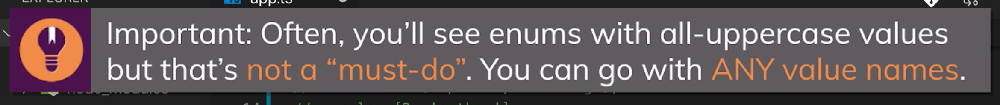

# ts_course

- [ts_course](#ts_course)
  - [Section 1 : Getting Started](#section-1--getting-started)
  - [Section 2 : TypeScript Basics & Basic Types](#section-2--typescript-basics--basic-types)
    - [01-ts-benefits](#01-ts-benefits)
    - [02-js-types](#02-js-types)
    - [03-core-data-types](#03-core-data-types)
    - [04-type-inferrance-and-assignments](#04-type-inferrance-and-assignments)
    - [05-object-types](#05-object-types)
    - [06-arrays](#06-arrays)
    - [07-tuples](#07-tuples)
    - [08-enums](#08-enums)
    - [09-union-types](#09-union-types)
    - [10-literal-types](#10-literal-types)
    - [11-type-aliases](#11-type-aliases)
    - [12-function-types](#12-function-types)
    - [13-unknown-never](#13-unknown-never)
  - [Section 3 : The TypeScript Compiler (and its Configuration)](#section-3--the-typescript-compiler-and-its-configuration)
    - [00-starting-setup](#00-starting-setup)
    - [01-watch-mode-tsconfig](#01-watch-mode-tsconfig)
    - [02-excluding](#02-excluding)
    - [03-config-finished](#03-config-finished)
    - [04-chrome-debugging](#04-chrome-debugging)
  - [Section 4 : Next-generation JavaScript & TypeScript](#section-4--next-generation-javascript--typescript)
    - [01-starting-setup](#01-starting-setup)
    - [02-let-conts-arrow-functions](#02-let-conts-arrow-functions)
    - [03-spread-operator](#03-spread-operator)
    - [04-spread-and-rest](#04-spread-and-rest)
    - [05-destructuring](#05-destructuring)
    - [06-finished](#06-finished)
  - [Section 5 : Classes & Interfaces](#section-5--classes--interfaces)
    - [01-starting-setup](#01-starting-setup-1)
    - [02-class-and-this-basics](#02-class-and-this-basics)
    - [03-private-and-public](#03-private-and-public)
    - [04-shorter-init-syntax](#04-shorter-init-syntax)
    - [05-readonly](#05-readonly)
    - [06-inheritance](#06-inheritance)
    - [07-overriding-and-protected](#07-overriding-and-protected)
    - [08-getters-and-setters](#08-getters-and-setters)
    - [09-abstract](#09-abstract)
    - [10-private-constructors](#10-private-constructors)
    - [11-basic-interfaces](#11-basic-interfaces)
    - [12-implementing-interfaces](#12-implementing-interfaces)
    - [13-interface-inheritance](#13-interface-inheritance)
    - [14-interface-function-types](#14-interface-function-types)
    - [15-optional-properties](#15-optional-properties)
  - [Section 6 : Advanced Types](#section-6--advanced-types)
    - [01-starting-setup](#01-starting-setup-2)
    - [02-intersection-types](#02-intersection-types)
    - [03-type-guards](#03-type-guards)
    - [04-discriminated-unions](#04-discriminated-unions)
    - [05-type-casting](#05-type-casting)
    - [06-index-properties](#06-index-properties)
    - [08-optional-chaining-nullish-coalescing](#08-optional-chaining-nullish-coalescing)
  - [Section 7 : Generics](#section-7--generics)
    - [01-starting-setup](#01-starting-setup-3)
    - [02-first-generic-method](#02-first-generic-method)
    - [03-another-generic-function](#03-another-generic-function)
    - [04-keyof-constraints](#04-keyof-constraints)
    - [05-generic-classes](#05-generic-classes)
    - [06-finished](#06-finished-1)
  - [Section 8 : Decorators](#section-8--decorators)
  - [Section 9 : Practice Time! Let's build a Drag & Drop Project](#section-9--practice-time-lets-build-a-drag--drop-project)
  - [Section 10 : Modules & Namespaces](#section-10--modules--namespaces)
  - [Section 11 : Using Webpack with TypeScript](#section-11--using-webpack-with-typescript)
  - [Section 12 : 3rd Party Libraries & TypeScript](#section-12--3rd-party-libraries--typescript)
  - [Section 13 : Time to Practice!](#section-13--time-to-practice)
  - [Section 14 : React.js & TypeScript](#section-14--reactjs--typescript)
  - [Section 15 : Node.js + Express & TypeScript](#section-15--nodejs--express--typescript)
  - [Section 16 : Course Roundup](#section-16--course-roundup)

## Section 1 : Getting Started


Install `ts`
https://www.typescriptlang.org/download

## Section 2 : TypeScript Basics & Basic Types

see `section2` examples folder

### 01-ts-benefits
```ts
function add(n1: number, n2: number) {
  return n1 + n2;
}

const number1 = 5;
const number2 = 2.8;

const result = add(number1, number2);
console.log(result);
```


### 02-js-types

> for `js` and `ts` all numbers are `floats`
```ts
const number1 = 5; // 5.0
```
### 03-core-data-types


### 04-type-inferrance-and-assignments


### 05-object-types
```ts
// const person: {
//   name: string;
//   age: number;
// } = {
const person = { // also with :object type
  name: 'Maximilian',
  age: 30
};
```
 or 
```ts
const person : {
    name : string;
    age : number;
} = {
    name: 'Maximilian',
    age: 30
};
```

`Nested Objects & Types` : Of course object types can also be created for nested objects.

Let's say you have this JavaScript object:
```ts
const product = {
  id: 'abc1',
  price: 12.99,
  tags: ['great-offer', 'hot-and-new'],
  details: {
    title: 'Red Carpet',
    description: 'A great carpet - almost brand-new!'
  }
}
```
This would be the type of such an object:
```ts
{
  id: string;
  price: number;
  tags: string[],
  details: {
    title: string;
    description: string;
  }
}
```
So you have an object type in an object type so to say.

### 06-arrays
```ts
(property) hobbies: string[]
```
example 
```js
    const person = {
    name: 'Maximilian',
    age: 30,
    hobbies: ['Sports', 'Cooking']
    };

    for (const hobby of person.hobbies) {
        console.log(hobby.toUpperCase());
    }
```

### 07-tuples
```ts
const person: {
  name: string;
  age: number;
  hobbies: string[];
  role: [number, string]; // tuples - fixed-length array : Added by TS
}
```
### 08-enums

```ts
enum Role { ADMIN = 'ADMIN', READ_ONLY = 100, AUTHOR = 'AUTHOR' };
```


see also [any](https://www.typescriptlang.org/docs/handbook/basic-types.html#any) type

### 09-union-types

```ts
function combine(input1: number | string, input2: number | string) {
  let result;
  if (typeof input1 === "number" && typeof input2 === "number") {
    result = input1 + input2;
  } else {
    result = input1.toString() + input2.toString();
  }
  return result;

```

### 10-literal-types
```ts
function combine(
  input1: number | string,
  input2: number | string,
  resultConversion: 'as-number' | 'as-text' // literal types
) {
  let result;
  if (typeof input1 === 'number' && typeof input2 === 'number' || resultConversion === 'as-number') {
    result = +input1 + +input2;
  } else {
    result = input1.toString() + input2.toString();
  }
  return result;
  // if (resultConversion === 'as-number') {
  //   return +result;
  // } else {
  //   return result.toString();
  // }
}

```
### 11-type-aliases

`type` keyword introduce by `ts`

```ts
type Combinable = number | string;
type ConversionDescriptor = 'as-number' | 'as-text';

function combine(
  input1: Combinable,
  input2: Combinable,
  resultConversion: ConversionDescriptor
) {
    ...
    ...
}
```
> Type Aliases & Object Types

Type aliases can be used to "create" your own types. You're not limited to storing union types though - you can also provide an alias to a (possibly complex) object type.

For example:
```ts
type User = { name: string; age: number };
const u1: User = { name: 'Max', age: 30 }; // this works!
```

This allows you to avoid unnecessary repetition and manage types centrally.

For example, you can simplify this code:
```ts
function greet(user: { name: string; age: number }) {
  console.log('Hi, I am ' + user.name);
}
 
function isOlder(user: { name: string; age: number }, checkAge: number) {
  return checkAge > user.age;
}

```
To:
```ts
type User = { name: string; age: number };
 
function greet(user: User) {
  console.log('Hi, I am ' + user.name);
}
 
function isOlder(user: User, checkAge: number) {
  return checkAge > user.age;
}
```

### 12-function-types
```ts
function add(n1: number, n2: number) {
  return n1 + n2;
}

let combineValues: (a: number, b: number) => number;
combineValues = add;
```
> **NOTE** usd [void](https://www.typescriptlang.org/docs/handbook/basic-types.html#void) for `function` and not [undefined](https://www.typescriptlang.org/docs/handbook/basic-types.html#null-and-undefined) that is a valid type. If you use `undefined` you must add a `return;` at your `function`


or using `callback` function :

```ts
function addAndHandle(n1: number, n2: number, cb: (num: number) => void) {
  const result = n1 + n2;
  cb(result);
}

addAndHandle(10, 20, (result) => {
  console.log(result);
});
```
> **NOTE** `void` in callback function is OK, it's meaning is ignore the result

See also  [unknown](https://www.typescriptlang.org/docs/handbook/basic-types.html#unknown) type and it's different to `any`

```ts
let notSure: unknown = 4;
notSure = "maybe a string instead";

// OK, definitely a boolean
notSure = false;
```

See also  [never](https://www.typescriptlang.org/docs/handbook/basic-types.html#never) type

```ts
// Function returning never must not have a reachable end point
function error(message: string): never {
  throw new Error(message);
}

// Inferred return type is never
function fail() {
  return error("Something failed");
}

// Function returning never must not have a reachable end point
function infiniteLoop(): never {
  while (true) {}
}
```


### 13-unknown-never

https://www.typescriptlang.org/docs/handbook/basic-types.html

## Section 3 : The TypeScript Compiler (and its Configuration)

https://www.typescriptlang.org/tsconfig

see `section3` examples folder

### 00-starting-setup

### 01-watch-mode-tsconfig

### 02-excluding

### 03-config-finished

### 04-chrome-debugging

you can run `watch` compile in this way

```
tsc app.ts -w
```

or if you have multiple files, create `tsconfig.json` with

```
tsc --init
```

and then with only `tsc` compile all files, or combined in `watch` mode :

```
tsc --watch
```

or

```
tsc -w
```

These links might also be interesting:

[tsconfig](https://www.typescriptlang.org/docs/handbook/tsconfig-json.html)

[Compiler Config](https://www.typescriptlang.org/docs/handbook/compiler-options.html)

[VS Code TS Debugging](https://code.visualstudio.com/docs/typescript/typescript-debugging)

## Section 4 : Next-generation JavaScript & TypeScript

see `section4` examples folder

### 01-starting-setup

### 02-let-conts-arrow-functions

### 03-spread-operator

### 04-spread-and-rest

### 05-destructuring

### 06-finished

https://kangax.github.io/compat-table/es6/

> [reference-vs-primitive-values](https://academind.com/learn/javascript/reference-vs-primitive-values/)

## Section 5 : Classes & Interfaces

see `section5` examples folder


### 01-starting-setup

### 02-class-and-this-basics

### 03-private-and-public

### 04-shorter-init-syntax

### 05-readonly

### 06-inheritance

### 07-overriding-and-protected

### 08-getters-and-setters

### 09-abstract

### 10-private-constructors

### 11-basic-interfaces

### 12-implementing-interfaces

### 13-interface-inheritance

### 14-interface-function-types

### 15-optional-properties

[Public_class_fields](https://developer.mozilla.org/en-US/docs/Web/JavaScript/Reference/Classes/Public_class_fields)
[Inheritance_and_the_prototype_chain](https://developer.mozilla.org/en-US/docs/Web/JavaScript/Inheritance_and_the_prototype_chain)

These links might also be interesting:

[More on (JS) Classes](https://developer.mozilla.org/en-US/docs/Web/JavaScript/Reference/Classes)

[More on TS Interfaces](https://www.typescriptlang.org/docs/handbook/interfaces.html)

## Section 6 : Advanced Types

see `section6` examples folder


### 01-starting-setup

### 02-intersection-types

### 03-type-guards

### 04-discriminated-unions

### 05-type-casting

### 06-index-properties

### 08-optional-chaining-nullish-coalescing

These links might also be interesting:

[More on Advanced Types](https://www.typescriptlang.org/docs/handbook/advanced-types.html)

## Section 7 : Generics

see `section7` examples folder


### 01-starting-setup

### 02-first-generic-method

### 03-another-generic-function

### 04-keyof-constraints

### 05-generic-classes

### 06-finished

[Promise](https://developer.mozilla.org/en-US/docs/Web/JavaScript/Reference/Global_Objects/Promise)

[utility-types](https://www.typescriptlang.org/docs/handbook/utility-types.html)

<!-- 0 / 12|52 min -->

## Section 8 : Decorators

see `section8` examples folder

<!-- 0 / 16|1 h 17 min -->

## Section 9 : Practice Time! Let's build a Drag & Drop Project

<!-- 0 / 20|2 h 41 min -->

## Section 10 : Modules & Namespaces

<!-- 0 / 11|50 min -->

## Section 11 : Using Webpack with TypeScript

<!-- 0 / 9|33 min -->

## Section 12 : 3rd Party Libraries & TypeScript

<!-- 0 / 7|30 min -->

## Section 13 : Time to Practice!

<!-- 0 / 8|27 min -->

## Section 14 : React.js & TypeScript

<!-- 0 / 13|45 min -->

## Section 15 : Node.js + Express & TypeScript

<!-- 0 / 9|43 min -->

## Section 16 : Course Roundup

<!-- 0 / 1|3 min -->
